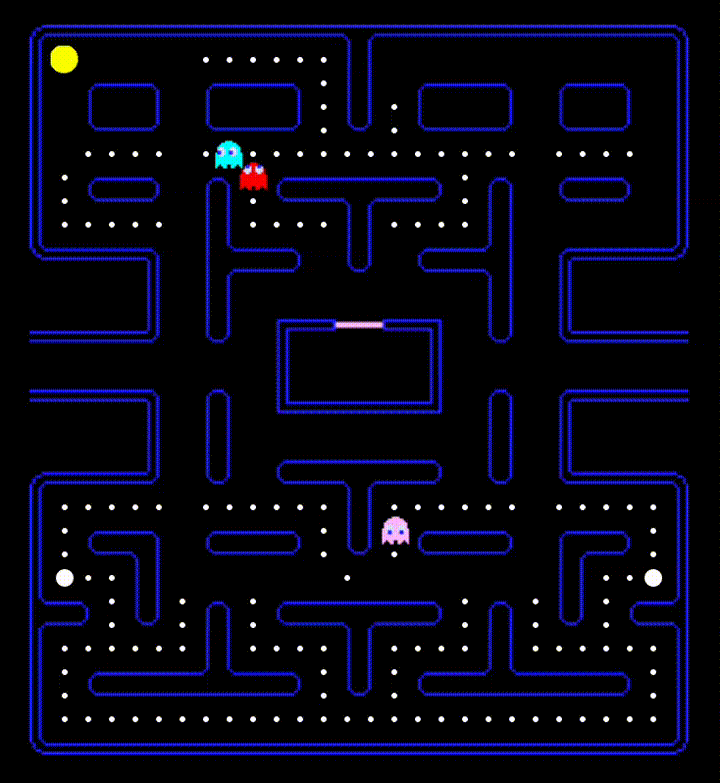

*This project has been created as part of the 42 curriculum by bchapuis, rtehar.*

[](https://42.fr)
[](https://www.typescriptlang.org/)
[](https://docs.docker.com/compose/)
[](https://fastify.dev/)

# 🏓 ft_transcendence

A full-stack single-page web application featuring real-time multiplayer Pong, a Pac-Man game, live chat, user profiles, tournaments, AI opponents, and customization — all served over HTTPS and containerized with Docker.

## 📖 Description

ft_transcendence is the **final project** of the 42 common core. The goal is to build a complete web application from scratch where users can play Pong (and a second game) directly in their browser. The project covers the entire stack: authentication, user management, real-time communication via WebSockets, game engine rendering on Canvas, AI opponents, tournaments, a live chat system, and a stats dashboard.

We completed this project as a **duo** (instead of the usual 3–5 people), implementing **7 major modules** worth of features.

### 🏗️ Architecture

```
                     ┌──────────────────────────────────────────────┐
    HTTPS :8443      │            Docker Network                    │
   ──────────────►   │  ┌──────────┐  /api   ┌────────────────┐     │
                     │  │  NGINX   │◄───────►│   Fastify      │     │
     HTTP :8080      │  │ TLSv1.2  │  /ws    │   Backend      │     │
   ──── 301 ────►    │  │ Frontend │◄───────►│   + WebSocket  │     │
                     │  └──────────┘         └───────┬────────┘     │
                     │                               │              │
                     │                         ┌─────▼──────┐       │
                     │                         │   SQLite   │       │
                     │                         │  Database  │       │
                     │                         └────────────┘       │
                     └──────────┬───────────────────┬───────────────┘
                                │                   │
                           ┌────▼────┐         ┌────▼────┐
                           │Uploads  │         │   DB    │
                           │ Volume  │         │ Volume  │
                           └─────────┘         └─────────┘
```

| Layer | Technology | Role |
|---|---|---|
| **Frontend** | TypeScript + Vite + Canvas API | SPA rendered entirely on `<canvas>`, NGINX serving static files |
| **Backend** | Fastify (Node.js) + TypeScript | REST API + WebSocket server for chat and real-time features |
| **Database** | SQLite (better-sqlite3) | Users, sessions, games, messages, friends, blocked users |
| **Proxy** | NGINX | HTTPS termination (TLSv1.2/1.3), reverse proxy to backend, HTTP→HTTPS redirect |
| **Infra** | Docker Compose | Two containers (frontend + backend), bridge network, persistent volumes |

## ✨ Modules Implemented

### Major Modules (×5)

| Module | Description |
|---|---|
| **Backend Framework** | Fastify REST API with modular routes (auth, users, games, chat), session-based authentication with secure tokens, input validation, and CORS configuration |
| **User Management** | Registration, login/logout, profile editing (username, email, avatar upload), friend system (add/remove), user blocking, online status tracking |
| **Live Chat** | Real-time private messaging via WebSockets, message history stored in database, block/unblock users, online indicators, direct game invitations from chat |
| **AI Opponent** | Intelligent Pong AI that predicts ball trajectory using iterative simulation with wall bounces, with configurable reaction speed and imprecision for a challenging opponent |
| **Second Game (Pac-Man)** | Full Pac-Man implementation with maze generation, ghost AI (3 ghosts), dot collection, power pellets, lives system, solo and duo modes |

### Minor Modules (×4)

| Module | Description |
|---|---|
| **Dashboard + Stats** | User statistics dashboard with win/loss ratio, win rate percentage, charts (bar chart for game types, recent game history), streak tracking |
| **Database** | SQLite with full schema (users, sessions, games, messages, friends, blocked users) with proper foreign keys and cascading deletes |
| **Browser Compatibility** | Fully tested and compatible on **Firefox** and **Chrome**, consistent rendering and WebSocket behavior across both browsers |
| **Game Customization & Power-ups** | Pong: three ball speed levels, winning score, obstacles, power-ups (speed boost, paddle grow/shrink). Pac-Man: ghost speed, lives count, power-up types |

## 🎮 Games

### Pong

The classic game reimagined with modern features:
- **1v1 Local** — two players on the same keyboard
- **vs AI** — play against an intelligent AI opponent
- **Tournament** — bracket-style tournament for 3–8 players with visual bracket display
- **Customization** — ball speed, winning score, obstacles, power-ups
- **Power-ups** — speed boost, paddle grow, paddle shrink

### Pac-Man

A complete second game implementation:
- **Solo** — classic Pac-Man with 3 ghosts, dots, and power pellets
- **Duo** — two players sharing the maze, competing for the highest score
- **Tournament** — bracket-style tournament for 3–8 players with visual bracket display
- **Customization** — ghost speed, number of lives, power-up configuration
- **Sound effects** — waka-waka, ghost eaten, death, victory sounds



## 🚀 Instructions

### 📋 Prerequisites

- Docker and Docker Compose
- `make`
- OpenSSL (for SSL certificate generation)

### ⚙️ Environment

Create a `.env` file at the root of the project with the following variable:

```env
JWT_SECRET=your_secret_key_here
```

### 🔨 Build & Run

```bash
# Generate SSL certificates + build + start
make

# Or step by step:
make ssl       # Generate self-signed SSL certificates
make build     # Build Docker images
make up        # Start containers
```

The application is accessible at:
```
https://localhost:8443
```

### 🧪 Available Commands

```bash
make          # Full setup (ssl + build + up)
make up       # Start containers
make down     # Stop containers
make restart  # Restart containers
make logs     # View container logs
make clean    # Stop + remove volumes
make fclean   # Full cleanup (images, volumes, SSL certs)
make re       # Full rebuild from scratch
```

## 🗂️ Project Structure

```
ft_transcendence/
├── Makefile                    # Build orchestration
├── docker-compose.yml          # Service definitions
├── generate-ssl.sh             # SSL certificate generation
│
├── backend/
│   ├── Dockerfile
│   ├── package.json / tsconfig.json
│   ├── server.ts               # Fastify server setup (HTTPS, CORS, WebSocket)
│   │
│   ├── auth/
│   │   ├── auth.routes.ts      # /api/auth — register, login, logout, session
│   │   ├── AuthService.ts      # Password hashing (bcrypt), token generation
│   │   ├── SessionManager.ts   # Session CRUD with expiry
│   │   └── authMiddleware.ts   # Route protection middleware
│   │
│   ├── users/
│   │   ├── users.routes.ts     # /api/users — profile, friends, blocking, avatar
│   │   ├── UserService.ts      # User CRUD operations
│   │   ├── FriendsService.ts   # Friend add/remove/list
│   │   ├── BlockService.ts     # Block/unblock users
│   │   └── AvatarService.ts    # Avatar upload and management
│   │
│   ├── games/
│   │   ├── games.routes.ts     # /api/games — game history, stats, dashboard
│   │   └── GamesService.ts     # Game recording and statistics queries
│   │
│   ├── chat/
│   │   ├── chat.routes.ts      # /api/chat — message history
│   │   ├── ChatService.ts      # Message storage and retrieval
│   │   └── WebSocketManager.ts # Real-time messaging + online status
│   │
│   └── database/
│       ├── db.ts               # SQLite connection (better-sqlite3)
│       ├── init.ts             # Database initialization
│       └── schema.sql          # Full database schema
│
└── frontend/
    ├── Dockerfile
    ├── nginx.conf              # NGINX config (HTTPS, reverse proxy, SPA)
    ├── index.html
    ├── vite.config.ts
    │
    ├── auth/                   # Login, registration, Player 2 auth screens
    ├── chat/                   # Chat UI, WebSocket client
    ├── menu/                   # Menu, customization screens
    ├── profile/                # Profile, friends list, dashboard, settings
    │
    └── games/
        ├── pong/               # PongGame, Ball, Paddle, HumanPlayer, AIPlayer, AIController
        │   ├── PowerUpManager  # Pong power-ups system
        │   └── PongEndScreen   # End game screen with stats
        ├── pacman/             # PacmanGame, Pacman, Ghost, Maze, SoundManager
        │   ├── PacmanPowerUpManager  # Pac-Man power-ups
        │   └── PacmanEndScreen
        ├── tournament/         # Tournament bracket, match screens
        ├── config/             # Game configs, customization options
        └── GameRecorder.ts     # Records game results to backend
 

```

## 🔒 Security

- **HTTPS enforced** — All traffic served over TLSv1.2/1.3, HTTP automatically redirected to HTTPS
- **JWT authentication** — Stateless session tokens with expiry, validated on every protected route via middleware
- **Password hashing** — bcrypt with salt rounds, no plaintext storage
- **SQL injection prevention** — All database queries use parameterized prepared statements (better-sqlite3)
- **XSS protection** — All user input is sanitized and escaped before rendering, no raw HTML injection
- **Input validation** — Server-side validation on all endpoints (username format, email format, password strength, value ranges)
- **CORS policy** — Restricted to allowed origins only
- **User blocking** — Blocked users cannot send messages or interact

## 📐 Code Standards

This project follows:
- **TypeScript strict mode** — Type safety across the entire codebase
- **Modular architecture** — Clear separation between auth, users, games, chat
- **HTTPS everywhere** — TLSv1.2/1.3, HTTP automatically redirected to HTTPS
- **Session security** — Secure random tokens, expiry management, middleware protection
- **Input validation** — All user input validated server-side (ValidationService)
- **Password security** — bcrypt hashing with salt rounds
- **No external game libraries** — Both games rendered from scratch on Canvas API
- **SPA routing** — Single `index.html`, all navigation handled client-side

## 📚 Resources

- [Fastify documentation](https://fastify.dev/docs/latest/) — Backend framework reference
- [Vite documentation](https://vitejs.dev/guide/) — Frontend build tool
- [Canvas API (MDN)](https://developer.mozilla.org/en-US/docs/Web/API/Canvas_API) — 2D rendering used for all game graphics
- [WebSocket API (MDN)](https://developer.mozilla.org/en-US/docs/Web/API/WebSockets_API) — Real-time communication for chat
- [better-sqlite3](https://github.com/WiseLibs/better-sqlite3) — Synchronous SQLite3 driver for Node.js
- [Docker Compose documentation](https://docs.docker.com/compose/) — Container orchestration
- [NGINX documentation](https://nginx.org/en/docs/) — Reverse proxy and HTTPS configuration

### 🤖 AI Usage

No AI tools were used during the development of this project.
